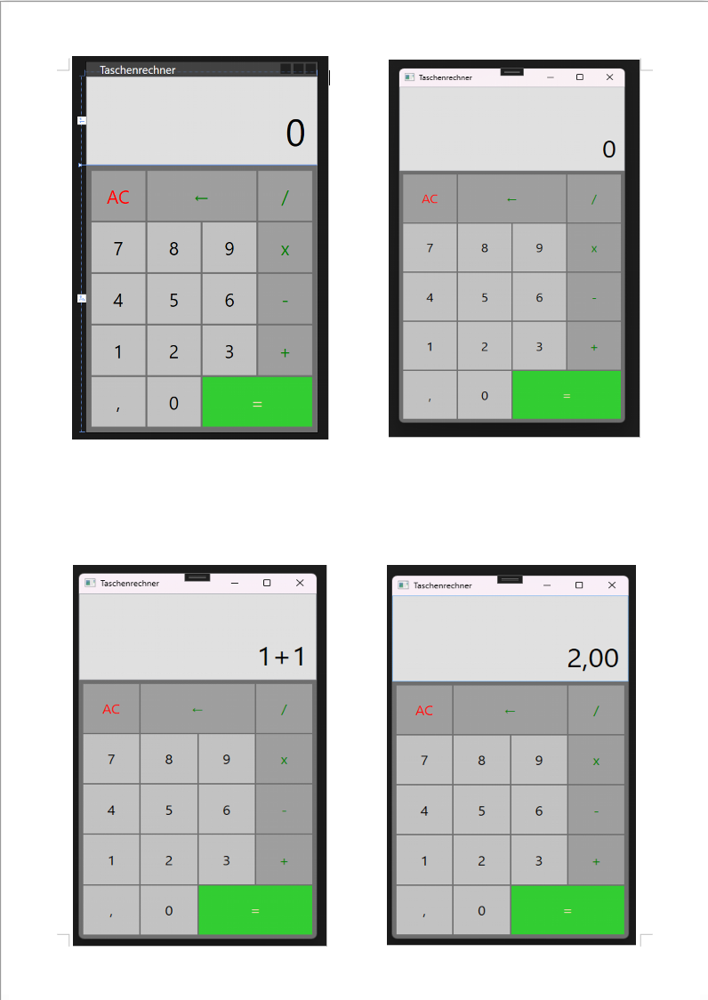
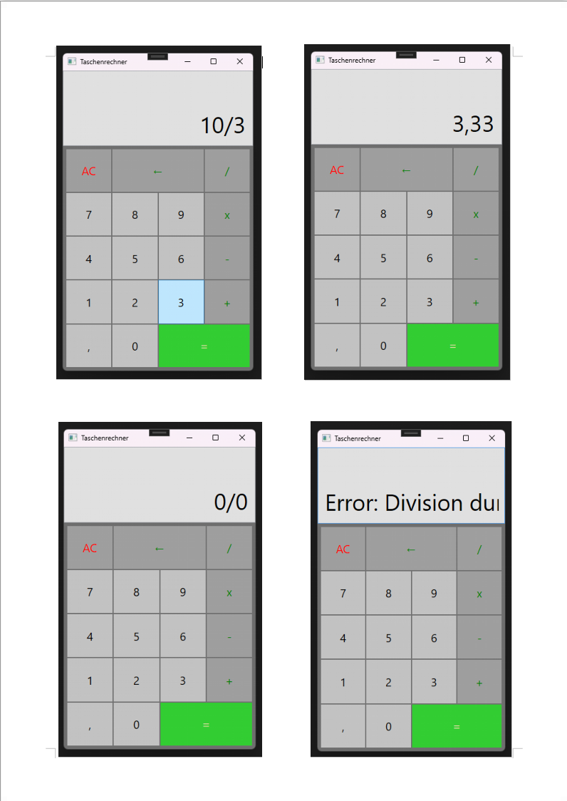

# taschenrechner
## Ein voll funktionsfähiger Desktop-Taschenrechner, entwickelt mit C# und der Windows Presentation Foundation (WPF).

### Taschenrechner – Funktionsübersicht:

Dieser Taschenrechner kann **nur die Grundoperationen** durchführen:

- Addition (+)  
- Subtraktion (−)  
- Multiplikation (×)  
- Division (÷)

 

Wichtig:  
- Es können immer nur **einfache Berechnungen** durchgeführt werden, z. B. `5 + 7` oder `9 − 3`.  
- Komplexe Ausdrücke mit mehreren Operatoren oder Klammern wie `5 + 8 × 8` oder `9 − 8 + 8 ÷ 4` werden **aktuell nicht unterstützt**, die Logik wird aber in Zukunft noch erweitert, um komplexere Berechnungen durchzuführen.

  

  

